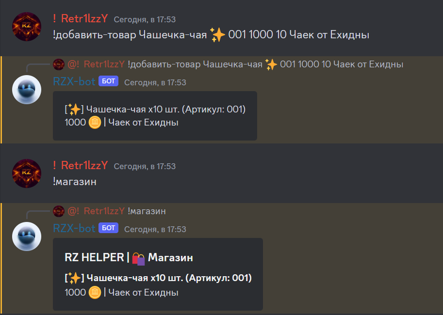
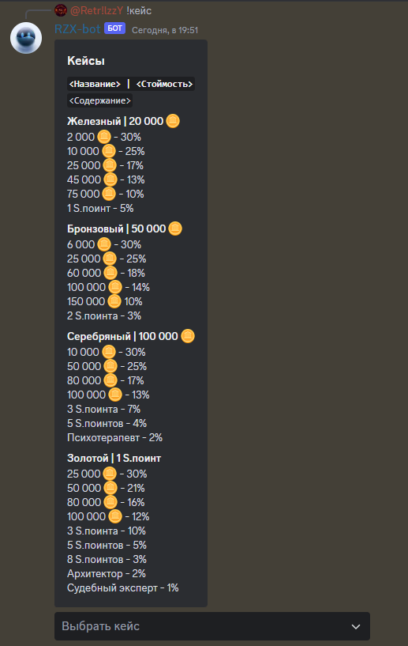

---
layout:
  title:
    visible: true
  description:
    visible: false
  tableOfContents:
    visible: true
  outline:
    visible: true
  pagination:
    visible: true
---

# 💸 Команды экономики

***


**Подсказка**

**`<...>`** - обязательный аргумент\
**`[...]`** - необязательный аргумент

\
**`/команда`**- вызов через слэш(/)\
**`!команда`** - вызов через префикс (по умолчанию `!`, можно изменить при помощи _`/manage-prefix`_ или через [панель управления](https://dash.rzx-bot.top))\
**`команда`** - вызов через слэш и префикс



Во многих командах есть такое понятие как **aliases** - это значит что команда **имеет несколько вариантов вызова**, например команда для просмотра профиля: `!профиль !профайл !п`


<code>баланс</code> - Просмотр баланса

**Использование:**\
`!баланс`

**Возможные варианты вызова команды:** \
`!б` `!баланс`

<code>безопасный-спин</code> - Безопасная рулетка с профессиями

**Использование:**\
`!сфспин`

**Возможные варианты вызова команды:** \
`!сфс` `!сфспин`

_\*Можно использовать один раз в 30 минут_

<code>вывести</code> - Вывести 🪙 (coin) из банка

**Использование:**\
`!вывод <сумма>`

`<сумма>` - Число больше нуля и меньше или равна вашему банковскому счёту

**Возможные варианты вызова команды:** \
`!в` `!вывести` `!вывод`

_\*Комиссия 2%_

<code>глобал-топ</code> - Лидеры по количеству 🪙 (coin) со всех серверов

**Использование:**\
`!глобал-топ`

**Возможные варианты вызова команды:** \
`!гтоп` `!глобал-топ`

<code>глобальный-магазин</code> - Посмотреть товар в глобальном магазине

**Использование:**\
`!гмагазин`

**Возможные варианты вызова команды:** \
`!гмагазик` `!гмагаз` `!гмагазин`

<code>депозит</code> - Положить 🪙 (coin) в банк

**Использование:**\
`!депозит <сумма>`

`<сумма>` - Число больше нуля и меньше или равна вашему балансу

**Возможные варианты вызова команды:** \
`!д`

_\*Комиссия 4%_

***

<code>добавить-товар</code> - Добавить товар в серверный магазин сервера

**Использование:**\
`!добавить-товар <название> <редкость> <артикул> <цена> <количество> <описание>`

`<название>` - Строка (макс. символов  - 40), может включать в себя как числа, так и буквы (без пробелов, если используете команду через префикс)

`<редкость>` - Строка (макс. символов  - 15), может включать в себя как числа, так и буквы (без пробелов, если используете команду через префикс)

`<артикул>` - Строка (макс. символов  - 15), может включать в себя как числа, так и буквы (без пробелов, если используете команду через префикс)

`<цена>` - Число от  0 до 2,147,483,648

`<количество>` - Число от 1 до 100,000

`<описание>` - Строка (макс. символов  - 200), может включать в себя как числа, так и буквы

**Пример:**\
`!добавить-товар Чашечка-чая ✨ 001 1000 10 Чаек от Ехидны`

<code>удалить-товар</code> - Удалить товар из серверного магазина

**Использование:**\
`!удалить-товар <артикул>`

`<артикул>` - Строка, может включать в себя как числа, так и буквы (без пробелов, если используете команду через префикс)

**Пример:**\
`!удалить-товар 001`


Для использования команд `!добавить-товар !удалить-товар` необходима роль с разрешением **"Управление сервером"** или вы должны быть **администратором**


***

<code>доход</code> - Зарплата с профессии

**Использование:**\
`!доход`

**Возможные варианты вызова команды:** \
`!зарплата` `!деньга` `!доход`

<code>инвентарь</code> - Посмотреть свой инвентарь или других пользователей

**Использование:**\
`!инвентарь` или `!инвентарь <участник>`

`<участник>` - Упоминание или ID участника сервера (Необходимо чтобы участник использовал любую команду экономики хотя бы один раз)

**Возможные варианты вызова команды:**\
&#x20;`!и` `!инвентарь` `!инвент`

<code>казино</code> - Казино (игра где можно подзаработать или все слить)

**Использование:**\
`!казик <ставка> <место>`

`<ставка>` - Число больше сотни[^1] и меньше или равна вашему балансу (Максимальная ставка - 50 000 000)

`<место>`: \
\- \[1-12, 13-24, 25-36] - `<ставка> × 3`;\
\- \[1-18, 19-36, четное, нечетное] - `<ставка> × 2`

**Возможные варианты вызова команды:** \
`!к` `!казино` `!казик`

**Пример:**\
`!казик 1000 13-24`

<code>кейсы</code> - Выбрать кейс для открытия

**Использование:**\
`!кейсы`

**Возможные варианты вызова команды:** \
`!кейсы` `!кейс`

**Пример:**\
`!кейсы`

<code>купить</code> - Купить товар из серверного магазина

**Использование:**\
`!купить <артикул>`

`<артикул>` - Строка, может включать в себя как числа, так и буквы (без пробелов, если используете команду через префикс)

**Пример:**\
`!купить 001`

<code>купить-глобал</code> - купить товар из глобального магазина

**Использование:**\
`!гкупить <артикул>`

`<артикул>` - Строка, может включать в себя как числа, так и буквы (без пробелов, если используете команду через префикс)

**Возможные варианты вызова команды:** \
**`!гкупить`** **`!купить-глобал`**

**Пример:**\
`!гкупить 2`

<code>лаки-джет</code> - Подобие игры Lucky-Jet

**Использование:**\
`!лаки-джет <ставка>`

`<ставка>` - Число больше сотни[^2] и меньше или равна вашему балансу (Максимальная ставка - 50 000 000)

**Возможные варианты вызова команды:** \
`!лк` `!лаки-джет`

**Пример:**\
`!лаки-джет 50000`

<code>лидерборд</code> - Лидеры по количеству 🪙 (coin) на сервере

**Использование:**\
`!топ`

**Возможные варианты вызова команды:** \
`!лидерборд` `!лидеры` `!топ`

<code>магазин</code> - Посмотреть товар в магазине

**Использование:**\
`!магазин`

**Возможные варианты вызова команды:** \
`!магазик` `!магаз` `!магазин`

<code>обменник</code>- Обменять валюты 

**Использование:**\
`!обменять <coin/s.point> <количество> <s.point/u.point>`\
**Толкование:** _обменять какое-то `количество`_ _`coin или s.point` в_ _`s.point или u.point`_

**Возможные варианты вызова команды:** `!обменник` `!обмен` `!обменять`

**Пример:**\
`!обменять coin 1000000 s.point`\
**Толкование:** _обменять 100000 coin в s.point_

<code>ограбить</code> - Ограбить кого-нибудь

**Использование:**\
`!ограбить <цель>`

`<цель>` - Упоминание или ID участника сервера (Необходимо чтобы участник использовал любую команду экономики хотя бы один раз)

**Возможные варианты вызова команды:**\
`!грабануть` `!грабить` `!ограблить` `!ограбить`

**Пример:**\
`!ограбить @neviz_`

_\*Можно использовать один раз в 30 минут_

<code>перевести</code> - Перевести 🪙 (coin) кому-нибудь

**Использование:**\
`!перевести <получатель> <сумма>`

`<получатель>` - Упоминание или ID участника сервера (Участник должен использовать любую команду экономики хотя бы один раз)

`<сумма>` - Число больше нуля и меньше или равна вашему балансу

**Возможные варианты вызова команды:** \
`!перевод` `!перевести`

**Пример:**\
`!перевести @retrilzzy 5000`

_\*Комиссия 10%_

***

<code>перевод-на-сервер</code> - Перевести 🪙 (coin) на свой баланс на другом сервере

**Использование:**\
`!серв-перевод <сумма> <ID сервера>`

`<сумма>` - Число больше нуля и меньше или равна вашему балансу

`<ID сервера>` - ID сервера (Для удачного перевода необходимо, чтобы вы на сервере, ID которого вы указали, использовали любую команду экономики хотя бы один раз)

**Возможные варианты вызова команды:** \
`!серв-перевести` `!перевод-на-сервер`

**Пример:**\
`!серв-перевод 7777 123456789`

_\*Комиссия 30%_\
\*_Можно использовать один раз в 60 минут_


Для перевода на другой сервер надо чтоб были разрешены переводы между серверами [#economy-settings-upravlenie-modulem-ekonomiki](general.md#economy-settings-upravlenie-modulem-ekonomiki "mention"), а также для удачного перевода необходимо, чтобы вы на сервере, ID которого вы указали, использовали любую команду экономики хотя бы один раз.


***

<code>профиль</code> - Посмотреть свой профиль или других участников

**Использование:**\
`!профиль` или `!профиль <участник>`

`<участник>` - Упоминание или ID участника сервера (Необходимо чтобы участник использовал любую команду экономики хотя бы один раз)

**Возможные варианты вызова команды:**\
&#x20;`!п` `!профайл` `!профиль`

<code>работать</code> - Дополнительные 🪙 (coin)

**Использование:**\
`!работать`

**Возможные варианты вызова команды:** \
`!работа` `!пахать` `!работать`

<code>рулетка</code>- Рулетка с поинтами

**Использование:**\
`!рулетка <тип>`

`<тип>` - _Бесплатная_ или _Платная (_Стоимость платной - 100 000 🪙 (coin))

**Возможные варианты вызова команды:** \
`!р` `!крутилка` `!рулетка`

**Пример:**\
`!рулетка бесплатная`

<code>русская-рулетка</code>- Русская рулетка один победитель

**Использование:**\
`!русская-рулетка <сумма>`

`<сумма>` - Число больше сотни[^3] и меньше или равна вашему балансу

**Возможные варианты вызова команды:**\
&#x20;`!р-р` `!русская-рулетка`

**Пример:**\
`!русская-рулетка 4000`

[^1]: 100

[^2]: 100

[^3]: 100
