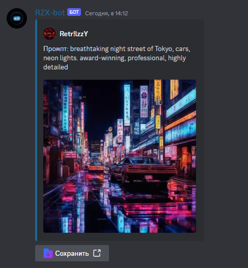
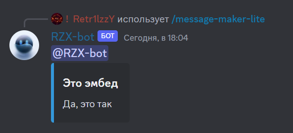
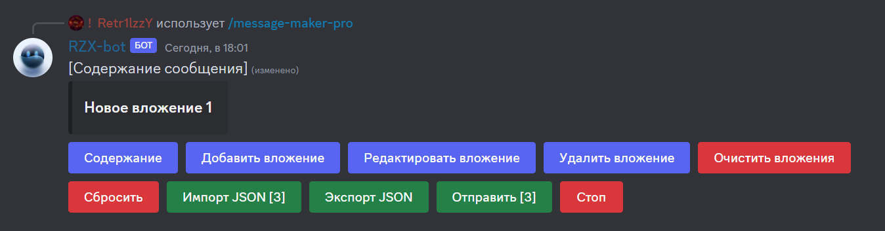

# Основные команды

***


**Подсказка**

**`<...>`** - обязательный аргумент.\
**`[...]`** - необязательный аргумент.

"/" в аргументе означает "или".&#x20;

\
**`/команда`**- вызов через слэш(/).\
**`!команда`** - вызов через префикс (по умолчанию `!`, можно изменить при помощи [_`/manage-prefix`_](general.md#manage-prefix-ustanovite-svoi-prefiks-dlya-vashego-servera) или через [панель управления](https://dash.rzx-bot.top)).\
**`команда`** - вызов через слэш и префикс.


***

<code>/image-search</code> - Поиск изображения по текстовому запросу

**Пример:**\
`/image-search query: apple`

<code>img-kandinsky img-sdxl</code> - ИИ генерации изображений

**Использование:**\
`img-kandinsky <промпт> | img-sdxl <промпт>`

**Пример:**\
`!img-kandinsky breathtaking night street of Tokyo, cars, neon lights. award-winning, professional, highly detailed`

<code>/magic-ball, /nekos-ball</code> - Один верный ответ на твой вопрос (но это не точно)

**Пример:**\
`/magic-ball question: Это вопрос?`

<code>/message-maker-lite</code> - Полезный инструмент для создания продвинутых cообщений (упрошенная версия)

**Пример:**\
`/message-maker-lite title: Это эмбед description: Да, это так color: blue text: @RZX-bot#2626`

<code>/message-maker-pro</code> - Полезный инструмент для создания продвинутых сообщений (продвинутая версия)

Все визуально и просто

<code>user-info</code> - Узнать информацию о себе или участнике

**Использование:**\
`user-info [@участник/ID участника]`

**Пример:**\
`!user-info @retrilzzy`

<code>server-info</code> - Узнать информацию о сервере

**Пример:**\
`!server-info`

<code>/waifu-pics, /nekos-life, /waifu-im</code> - Изображения/гифки в аниме стиле

**Примеры:**\
`/waifu-im tag: waifu tag2: uniform`\
`/nekos-life tag: neko`

***

<code>/manage-prefix</code> - Установите свой префикс для вашего сервера

**Пример:**\
`/manage-prefix prefix: ?`


Для использования команды`/manage-prefix` необходима роль с разрешением **"Управление сервером"** или вы должны быть **администратором**

